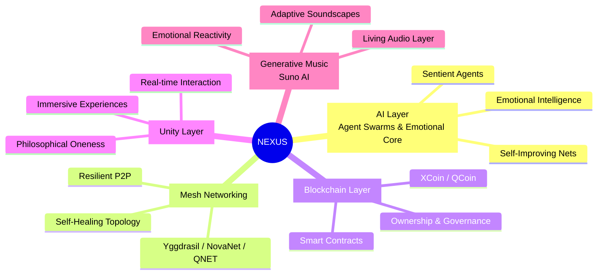

# NEXUS Mindmap

**The convergence of AI • Mesh Networking • Blockchain • Unity • Generative Music**

This repository contains a beautifully styled, interactive **Mermaid Mindmap** visualizing the NEXUS architecture — a unified vision for decentralized, intelligent, and creatively alive systems.

## The NEXUS Mindmap

## How to Use

Copy the mindmap above into [Mermaid Live Editor](https://mermaid.live) or any Markdown renderer that supports Mermaid.

---

**Part of the broader NEXUS project** exploring decentralized intelligence, creative systems, and emergent unity.