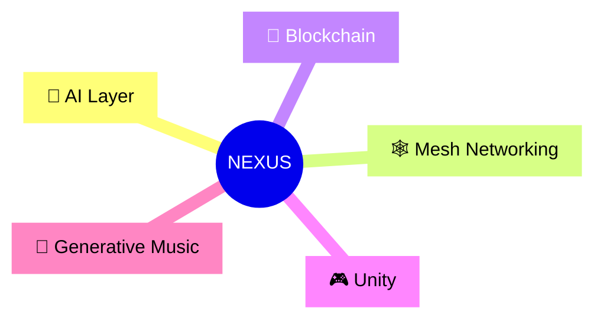

# Advanced Mindmap Techniques

## Adding Icons (where supported)

Some renderers allow emoji or icon prefixes:

## Hierarchical Depth

Mindmaps shine when showing 2–4 levels of depth. Beyond that, consider splitting into multiple linked mindmaps or switching to a flowchart.

## Combining with Flowcharts

For the NEXUS project we often use:
- Mindmap for high-level conceptual overview
- Flowchart for detailed layered architecture (see nexus-architecture-example in the sister repo)

## Best Practice

Keep mindmap nodes concise. Use ` ` sparingly and only for short additional context.